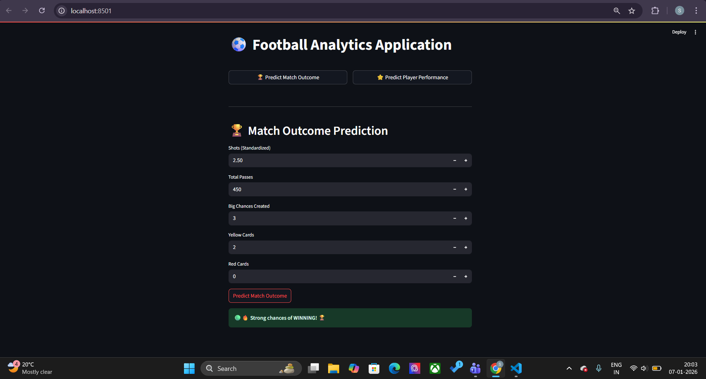
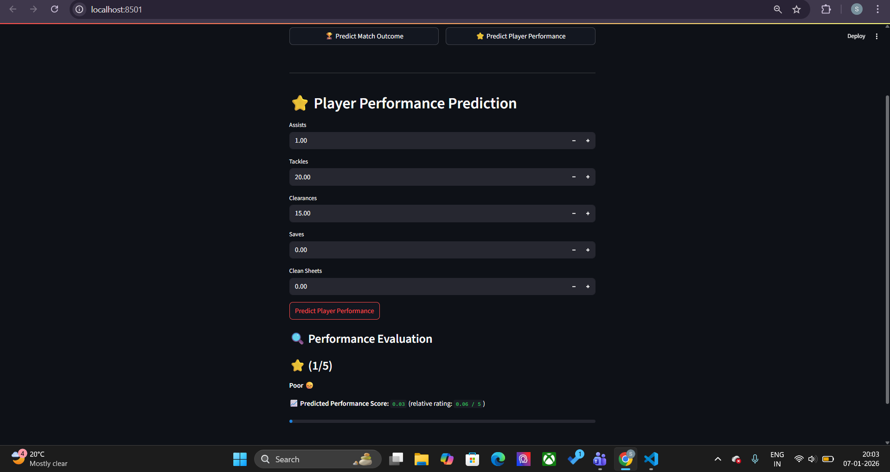

⚽ Football Analytics System
Match Outcome & Player Performance Prediction using Machine Learning

This project implements a complete end-to-end football analytics pipeline, starting from raw match data and ending with a production-ready Streamlit application.

It combines:

Classification → Predicting match outcome (Win / Draw / Loss)

Regression → Predicting individual player performance (Score → Star Rating)

📌 Project Overview

Dataset: Football match and player statistics

Models Used:

Gradient Boosting Classifier (Match Outcome)

Random Forest Regressor (Player Performance)

Frontend: Streamlit

Focus Areas:

Data integrity

Feature engineering

Leakage prevention

Interpretability

Deployment-ready inference

📁 Project Structure
├── dataset/
│   └── 2020-09-24.csv
├── notebooks/
│   └── football_ml_pipeline.ipynb
├── models/
│   ├── top5_gradient_boosting_classifier.pkl
│   ├── top5_random_forest_regressor.pkl
│   ├── top5_classification_imputer.pkl
│   └── top5_regression_imputer.pkl
├── screenshots/
│   ├── app_layout.png
│   ├── match_outcome_prediction.png
│   └── player_performance_prediction.png
├── app.py
├── requirements.txt
└── README.md

🧠 Machine Learning Workflow
(20-Step Training & Evaluation Pipeline)

This section documents the complete workflow used to train, optimize, and validate the models.

1️⃣ Setup & Data Loading

Imported core libraries: pandas, matplotlib, scikit-learn

Loaded the raw dataset: 2020-09-24.csv

2️⃣ Initial Inspection

Dataset inspection using:

.shape

.info()

.describe()

Identified missing values and datatype inconsistencies

3️⃣ Role-Based Feature Categorization

Grouped columns by player role:

Goalkeeper

Defender

Midfielder

Attacker

Enabled role-aware data processing

4️⃣ Logic-Based Data Cleaning

Removed irrelevant identifiers:

Player Name

Jersey Number

Resolved ambiguous 0 values:

Treated as valid or missing based on player role

5️⃣ Exploratory Data Analysis (EDA)

Visualizations:

Goal distributions

Shots vs Goals scatter plots

Match statistics bar charts

Identified skewness and correlations

6️⃣ Feature Cleaning

Converted percentage-based features (e.g., Tackle success %) from strings to numeric values

7️⃣ Feature Scaling

Applied:

MinMaxScaler

StandardScaler

Compared distributions before and after scaling

8️⃣ Target Engineering
🔹 MatchOutcome (Classification)

Derived from match results

Classes:

Win

Draw

Loss

🔹 PerformanceScore (Regression)

Engineered using normalized player statistics:

Assists

Tackles

Clearances

Saves

Clean Sheets

9️⃣ Role-Aware Imputation Strategy

Implemented custom logic:

Non-role features set to 0

Role-specific missing values filled using role medians

🔟 Data Preparation

Separated features (X) and targets (y)

One-hot encoded categorical features

Label encoded classification target where required

1️⃣1️⃣ Leakage Prevention

Removed features used in target construction from model inputs

Ensured no information leakage

1️⃣2️⃣ Train–Test Split

Split data into:

80% training

20% testing

Performed separately for both tasks

1️⃣3️⃣ Final Imputation

Applied SimpleImputer(strategy="median")

Ensured consistent preprocessing

1️⃣4️⃣ Baseline Models

Regression: Linear Regression

Classification: Logistic Regression

1️⃣5️⃣ Baseline Evaluation

Regression metrics:

MAE

RMSE

R²

Classification metrics:

Accuracy

Precision

Recall

F1-score

1️⃣6️⃣ Advanced Models

Regression: Random Forest Regressor

Classification: Gradient Boosting Classifier

1️⃣7️⃣ Hyperparameter Tuning

Random Forest → GridSearchCV

Gradient Boosting → RandomizedSearchCV

1️⃣8️⃣ Feature Selection (Top-5)

Selected the 5 most important features for each task

Retrained optimized models using only these features

Improved interpretability and deployment efficiency

1️⃣9️⃣ Model Serialization

Saved models and imputers using joblib

Produced .pkl files for deployment

2️⃣0️⃣ Inference Testing

Reloaded saved models

Tested on manually constructed edge cases

Verified prediction consistency

🚀 Streamlit Application — Inference Pipeline

The Streamlit app provides a clean frontend interface for real-time predictions using pre-trained models.

🔹 Application Layout

Overall structure of the Streamlit app

📸 Screenshot Placeholder — App Layout

[ app_layout.png ]

🔹 Match Outcome Prediction
Input Features

Shots (standardized)

Passes

Big chances created

Yellow cards

Red cards

Prediction Flow

User inputs collected

Features aligned with training schema

Missing values handled via trained imputer

Gradient Boosting model predicts outcome

Output

Win → Green banner

Draw → Blue banner

Loss → Red banner

📸 Screenshots

Input Features

Assists

Tackles

Clearances

Saves

Clean sheets

Prediction Flow

User inputs collected

Feature alignment ensures schema consistency

Random Forest model predicts raw score

Score normalized relative to observed max (2.55)

Output

Star rating (⭐ to ⭐⭐⭐⭐⭐)

Qualitative label (Poor → Elite)

Progress bar visualization

📸 Screenshot Placeholder — Player Performance Prediction

[ player_performance_prediction.png ]

🛠️ How to Run the Application
pip install -r requirements.txt
streamlit run app.py

📌 Key Highlights

End-to-end ML pipeline

Strong data integrity and leakage prevention

Lightweight deployment models

Interpretable predictions

Production-grade Streamlit UI

👤 Author

Shivanshu